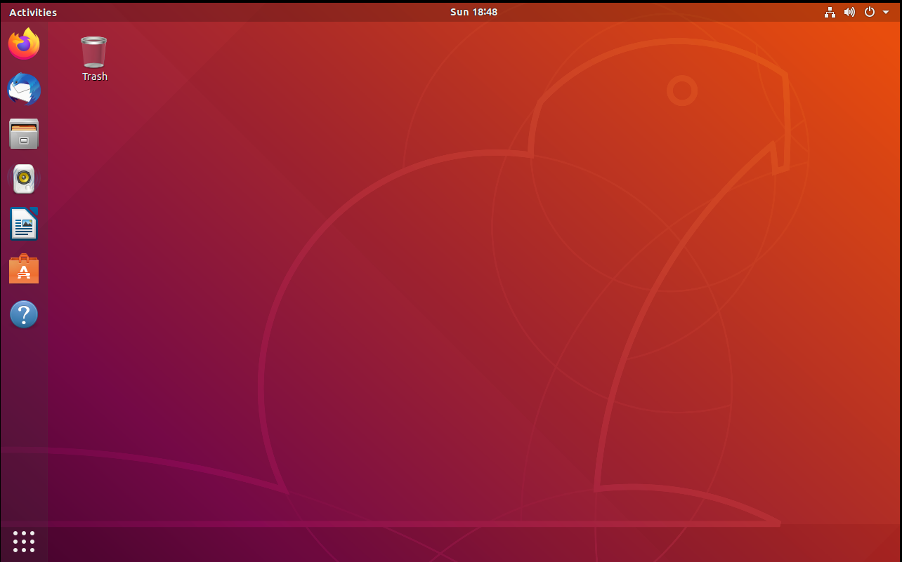
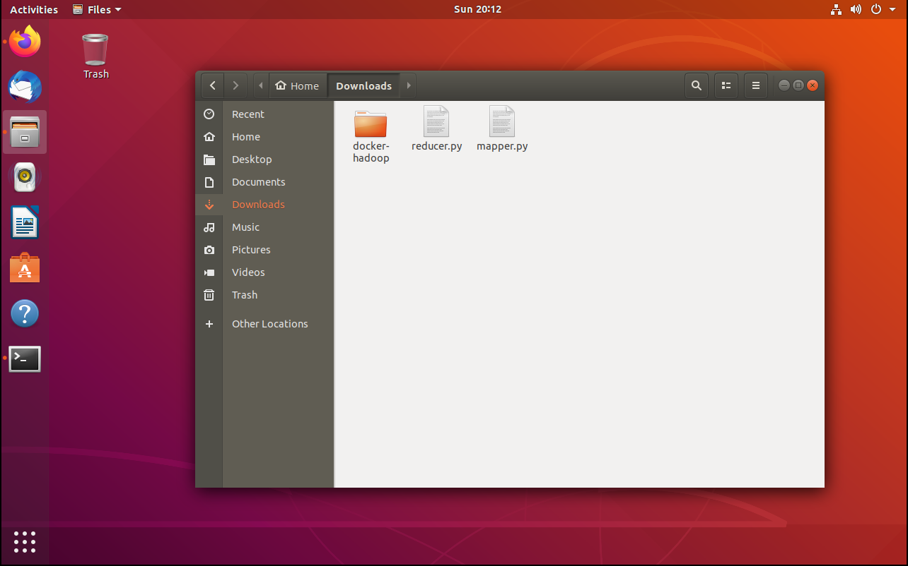
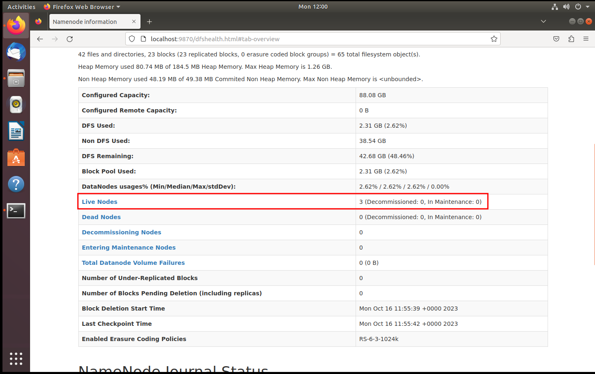
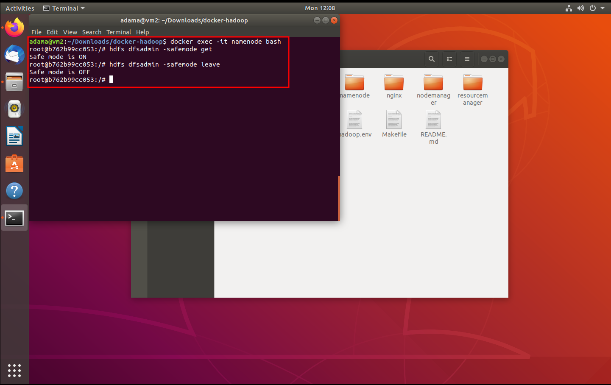
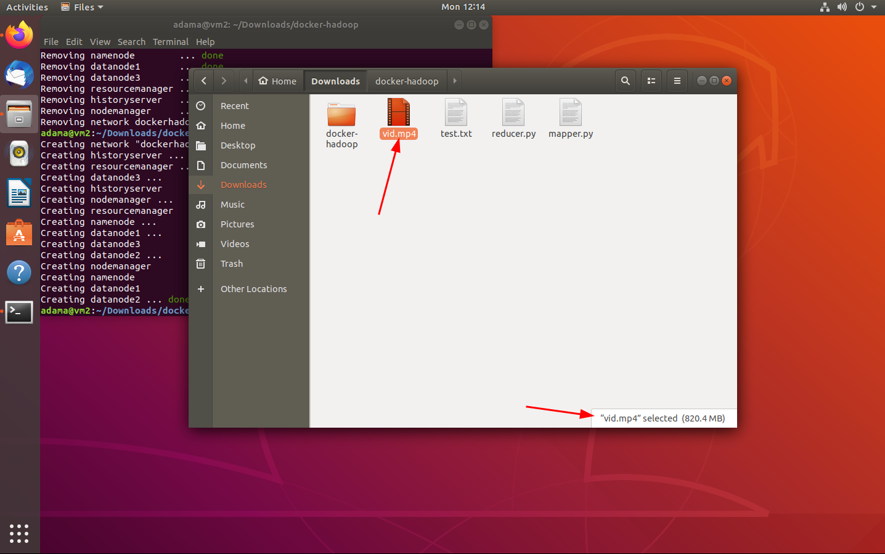
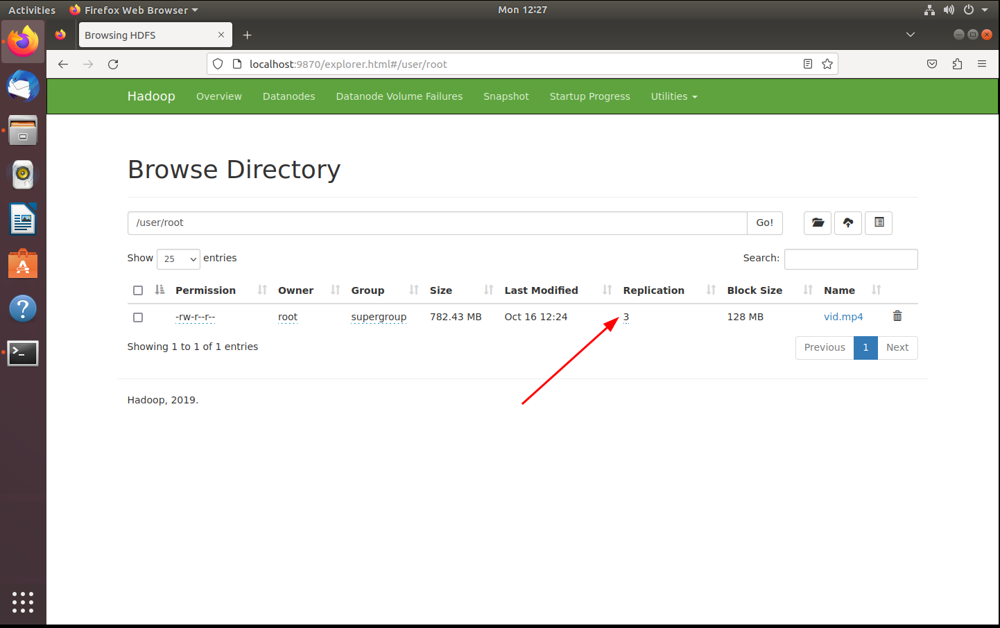

# Hadoop sur docker

*Author: Adama SAMAKE* | adama.samake.work@gmail.com

## Lab 1

- Installer ubuntu 18.04 en machine virtuelle (Faire une mise à jour dus système est recommandée)

  

- Installer git, docker et docker-compose sur la machine virtuelle

  `sudo apt update && sudo apt install git docker docker-compose`

- Lancer le service docker

  `sudo service docker start`

- Ajouter l'utilisateur au groupe docker pour une agréable exécution des commandes

  `sudo usermod -aG docker $USER`

- Télécharger l'image docker hadoop

  ` cd ~/Downloads`

  `git clone https://github.com/big-data-europe/docker-hadoop.git`

- Lancer les conteneurs dockers à partir de l'image

  ` cd ~/Downloads/docker-hadoop/`

  `docker-compose up -d`

- Vérifier l'état des conteneurs docker

  `docker ps`

- Vérifier que le datanode est bien actif en allant sur le lien `http://localhost:9870`

- Déplacer les fichiers ***reducer.py*** et ***mapper.py*** dans le repertoire `~/Downloads`

  

- Copier les deux fichiers scripts sur le namenode ainsi que le fichier de test

  `docker cp ~/Downloads/mapper.py namenode:mapper.py`

  `docker cp ~/Downloads/reducer.py namenode:reducer.py`

  `docker cp ~/Downloads/test.txt namenode:test.txt`

- Mettre à jour les sources de paquets sur les différents conteneurs et installer la version 3 de python

  `docker exec -it nodemanager bash -c "echo \"deb http://archive.debian.org/debian/ stretch contrib main non-free\" > /etc/apt/sources.list"`

  `docker exec -it historyserver bash -c "echo \"deb http://archive.debian.org/debian/ stretch contrib main non-free\" > /etc/apt/sources.list"`

  `docker exec -it namenode bash -c "echo \"deb http://archive.debian.org/debian/ stretch contrib main non-free\" > /etc/apt/sources.list"`

  `docker exec -it datanode bash -c "echo \"deb http://archive.debian.org/debian/ stretch contrib main non-free\" > /etc/apt/sources.list"`

  `docker exec -it resourcemanager bash -c "echo \"deb http://archive.debian.org/debian/ stretch contrib main non-free\" > /etc/apt/sources.list"`

  `docker exec -it nodemanager bash -c "apt update && apt install python3 -y"`

  `docker exec -it historyserver bash -c "apt update && apt install python3 -y"`

  `docker exec -it namenode bash -c "apt update && apt install python3 -y"`

  `docker exec -it datanode bash -c "apt update && apt install python3 -y"`

  `docker exec -it resourcemanager bash -c "apt update && apt install python3 -y"`

- Se connecter au namenode

  `docker exec -it namenode bash`

- Vérifier que les scripts y sont présents

  `ls -l`

- Créer un répertoire qui contiendra les fichiers d'entrée de nos jobs mapreduce

  `mkdir input`

  `mv test.txt input/`

  `echo "Hello World" >input/f1.txt`

  `echo "Hello Docker" >input/f2.txt`

  `echo "Hello Hadoop" >input/f3.txt`

  `echo "Hello MapReduce" >input/f4.txt`

  `ls -l input`

- Copier les fichiers d'entrée sur le hdfs pour que le mapreduce y ait accès

  `hadoop fs -mkdir -p input`

  `hdfs dfs -put ./input/* input`

- Lancer le mapreduce

  `mapred streaming -files mapper.py,reducer.py -mapper 'python3 mapper.py' -reducer 'python3 reducer.py' -input input -output output`

- Afficher le resultat du mapreduce

  `hdfs dfs -cat output/part-00000 >> result.txt`

  `head result.txt`

- Pour arrêter les conteneurs dockers

  `docker-compose down`

## Lab 2

- Copier le fichier `docker-compose.yml` dans le répertoire `~/Downloads/docker-hadoop` et écraser l'ancien fichier

- Relancer les conteneurs si jamais vous les avez arrêté et vérifier qu'ils ont bien demarré

  `docker-compose up -d`

  `docker ps`

- Vérifier que les datanodes sont bien actifs en allant sur le lien `http://localhost:9870`

  

- Suite à la modification du nombre de datanode, le namenode passe en mode **safemode** juste le temps que les datanodes confirment tous les blocs de fichiers disponibles. Comme l'on a eu à faire des manipulations avant avec un seul datanode, nous allons retirer le mode **safemode** et supprimer nos anciens fichiers

  `docker exec -it namenode bash`

  `hdfs dfsadmin -safemode get`

  `hdfs dfsadmin -safemode leave`

  

  `hdfs dfs -rm -r input output`

- Télécharger n'importe quel fichier de 700MB au moins

  

- Relancer les conteneurs docker de hadoop et copier le fichier vers le namenode (Dans mon cas un fichier video)

  `docker-compose down`

  `docker-compose up -d`

  `docker cp ~/Downloads/vid.mp4 namenode:vid.mp4`

- Ajouter le fichier au hdfs

  `docker exec -it namenode bash`

  `hdfs dfs -put vid.mp4 .`

  <u>PS:</u> N'oubliez pas de retirer le safemode :p

  

  